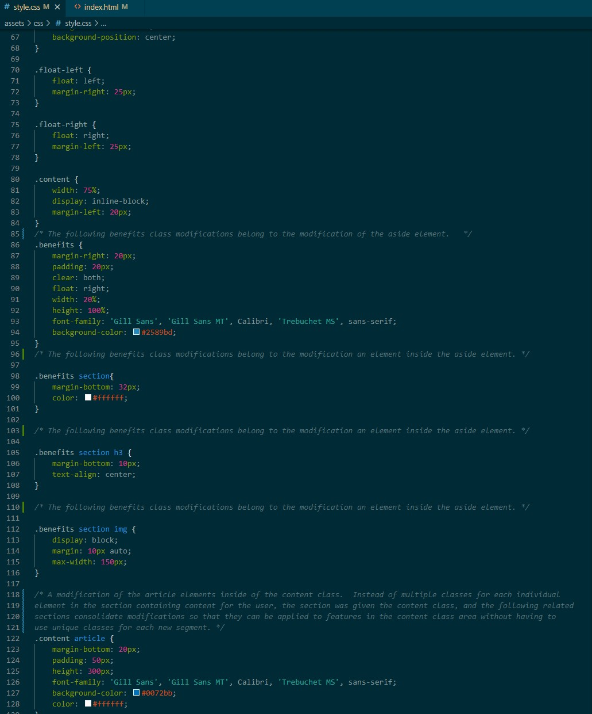
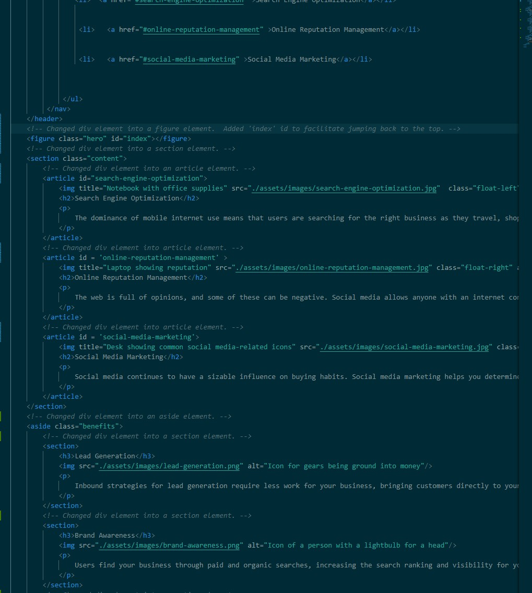

# bcamp-marketing-agency-01
Week one challenge

Students were tasked with streamlining code and implementing accessibility features for a mock-up website for a fictious company, Horiseon, a fake marketing firm.

index.html and style.css are modified from the original code sourced from the UCI Web developer program, as per the assignment requirements.  Image assets used were unaltered.
Source location: https://git.bootcampcontent.com/University-of-California---Irvine/UCI-VIRT-FSF-PT-09-2023-U-LOLC/-/tree/main/01-HTML-Git-CSS/02-Challenge

Update:
(Updated Version 2.0)
- Navigation links were fixed so that they now go to static anchors within the page.
- Comments added to both index.html and style.css.
- Readme updated with list of changes.
- Readme updated with links to source repository and github page.
- Readme updated with comparison pictures.

https://github.com/Scrysis/bcamp-marketing-agency-01

https://scrysis.github.io/bcamp-marketing-agency-01/

)

Base image of web page.

Screenshot of edited and commented style.css file.

Screenshot of edited and commented index.html file.
